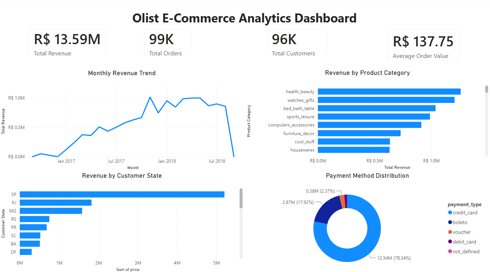
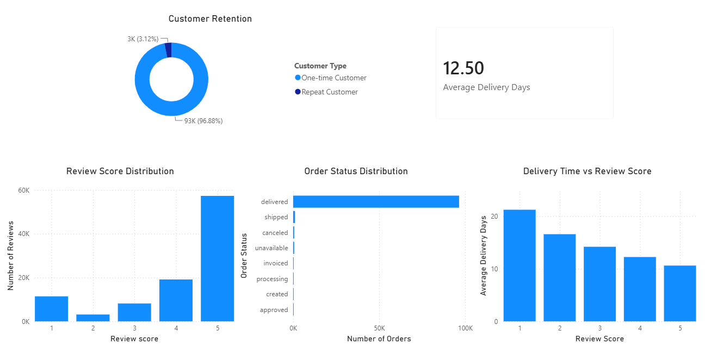
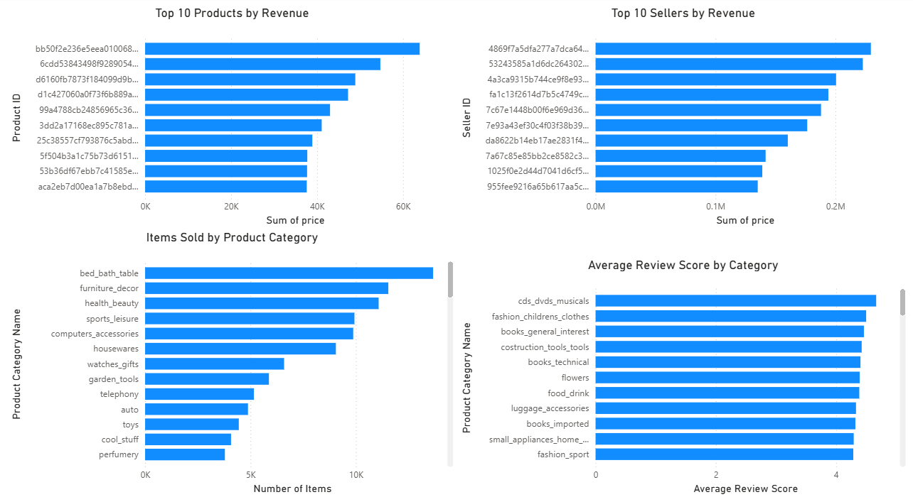

# Olist E-Commerce Analytics

An end-to-end e-commerce analytics project using **SQL Server** and **Power BI** to analyze customer behavior, sales performance, payments, delivery operations, reviews, products, and sellers.

## Project Overview

This project analyzes the **Brazilian E-Commerce Public Dataset by Olist**.

The workflow covers the complete analytics process:

**Raw CSV Data → SQL Server → Data Validation → Exploratory Analysis → Advanced SQL Analysis → Business Insights → Power BI Dashboard**

The objective is to transform raw transactional data into actionable business insights.

## Tools & Technologies

- SQL Server
- SQL Server Management Studio (SSMS)
- Power BI
- DAX
- Git
- GitHub

## Dataset

The project uses nine related tables:

- `customers`
- `orders`
- `order_items`
- `order_payments`
- `order_reviews`
- `products`
- `sellers`
- `geolocation`
- `product_category_translation`

The raw CSV files are intentionally excluded from GitHub because of their size.

See [`data/README.md`](data/README.md) for information about obtaining and loading the dataset.
## Database Structure

The main analytical relationships are:

- `customers` → `orders`
- `orders` → `order_items`
- `orders` → `order_payments`
- `orders` → `order_reviews`
- `order_items` → `products`
- `order_items` → `sellers`
- `products` → `product_category_translation`

These relationships form the basis of the SQL analysis and Power BI data model.

## SQL Analysis

The SQL analysis is organized into five stages.

### 01 — Database Setup

[`sql/01_database_setup.sql`](sql/01_database_setup.sql)

Creates and prepares the SQL Server database and imported tables.

### 02 — Data Validation

[`sql/02_data_validation.sql`](sql/02_data_validation.sql)

Validates:

- Row counts
- NULL values
- Duplicate records
- Foreign-key consistency
- Orphan records
- Date consistency
- Referential integrity

### 03 — Exploratory Analysis

[`sql/03_exploratory_analysis.sql`](sql/03_exploratory_analysis.sql)

Analyzes:

- Overall sales
- Order volume
- Average order value
- Monthly revenue
- Product categories
- Payment methods
- Customer states
- Order status
### 04 — Advanced Analysis

[`sql/04_advanced_analysis.sql`](sql/04_advanced_analysis.sql)

Uses advanced SQL techniques including:

- CTEs
- Window functions
- `RANK()`
- `ROW_NUMBER()`
- `LAG()`
- Conditional aggregation
- Date-based analysis

### 05 — Business Insights

[`sql/05_business_insights.sql`](sql/05_business_insights.sql)

Converts the analysis into business-oriented findings involving:

- Customer retention
- Delivery performance
- Review scores
- Payment behavior
- Category performance
- Geographic performance

## Power BI Dashboard

The Power BI report contains three analytical pages.

### Executive Overview

Provides a high-level view of marketplace performance.

Key metrics and analyses include:

- Total Revenue
- Total Orders
- Total Customers
- Average Order Value
- Monthly Revenue Trend
- Revenue by Product Category
- Revenue by Customer State
- Payment Method Distribution

### Customer & Operations

Focuses on customer behavior and operational performance.

Key analyses include:

- Customer Retention
- Average Delivery Days
- Review Score Distribution
- Delivery Time vs Review Score
- Order Status Distribution

### Product & Seller Analysis

Examines product and seller performance.

Key analyses include:

- Top 10 Products by Revenue
- Top 10 Sellers by Revenue
- Items Sold by Product Category
- Average Review Score by Category

## Key Findings

### Sales Performance

The marketplace generated approximately:

- **R$13.59M** in product revenue
- **98.7K** orders
- **96K** unique customers
- **R$137.75** average order value

### Customer Retention

Only approximately **3.12%** of customers made repeat purchases.

This indicates a strong opportunity to improve customer retention and encourage repeat purchases.

### Delivery Performance

Average delivery time was approximately **12.5 days**.

Delivery performance showed a clear relationship with customer satisfaction:

| Review Score | Average Delivery Days |
|---:|---:|
| 1 | ~21 days |
| 2 | ~17 days |
| 3 | ~14 days |
| 4 | ~12 days |
| 5 | ~11 days |

Customers giving lower ratings tended to experience longer delivery times.

### Geographic Performance

São Paulo was the largest state market by a substantial margin, followed by Rio de Janeiro and Minas Gerais.

### Payment Behavior

Credit cards accounted for approximately **78% of payment value**, making them the dominant payment method.

### Product Performance

Health & Beauty generated the highest category revenue, while Bed, Bath & Table had the highest item volume among the leading categories.

This demonstrates that sales volume and revenue contribution are not necessarily the same.
## Business Recommendations

Based on the analysis:

1. **Improve customer retention**
   - Introduce loyalty programs
   - Develop personalized product recommendations
   - Implement post-purchase campaigns
   - Provide repeat-purchase incentives

2. **Reduce delivery delays**
   - Identify underperforming sellers and regions
   - Improve logistics coordination
   - Monitor estimated versus actual delivery performance

3. **Prioritize high-value categories**
   - Focus marketing and inventory planning on high-revenue categories
   - Analyze category profitability alongside sales volume

4. **Use review data operationally**
   - Monitor low-review orders
   - Identify delivery-related dissatisfaction
   - Use review trends to evaluate sellers and logistics

5. **Optimize the payment experience**
   - Continue supporting credit-card payments
   - Analyze alternative payment methods for customer growth opportunities

## Data Quality

The project includes dedicated SQL validation covering:

- Row-count validation
- NULL-value analysis
- Duplicate detection
- Foreign-key validation
- Orphan-record detection
- Date consistency checks
- Referential integrity

This ensures that the business analysis is based on validated data rather than assuming the raw dataset is clean.

## Key SQL Skills Demonstrated

- `SELECT`
- `WHERE`
- `GROUP BY`
- `HAVING`
- `JOIN`
- `CASE`
- Aggregate functions
- CTEs
- Subqueries
- Window functions
- `RANK()`
- `ROW_NUMBER()`
- `LAG()`
- Date functions
- Conditional aggregation
- Data-quality validation
## Key Power BI Skills Demonstrated

- SQL Server data connectivity
- Data modeling
- Relationship management
- DAX measures
- Calculated logic
- KPI cards
- Bar charts
- Line charts
- Donut charts
- Top-N filtering
- Interactive analytical dashboards

## Repository Structure

- `.gitignore`
- `README.md`
- `data/`
  - `raw/`
  - `README.md`
- `documentation/`
  - `data_dictionary.md`
- `powerbi/`
  - `Olist_Ecommerce_Analytics.pbix`
- `screenshots/`
  - `executive_overview.png`
  - `customer_operations.png`
  - `product_seller_analysis.png`
- `sql/`
  - `01_database_setup.sql`
  - `02_data_validation.sql`
  - `03_exploratory_analysis.sql`
  - `04_advanced_analysis.sql`
  - `05_business_insights.sql`

## How to Reproduce

1. Obtain the Olist Brazilian E-Commerce dataset.
2. Place the CSV files in `data/raw/`.
3. Create the SQL Server database.
4. Run the scripts in the `sql/` directory in numerical order.
5. Open the Power BI file located at `powerbi/Olist_Ecommerce_Analytics.pbix`.
6. If necessary, update the SQL Server connection to your local database instance.
7. Refresh the Power BI model.

## Project Outcome

This project demonstrates an end-to-end analytics workflow, from raw transactional data and database validation to SQL analysis, business insights, and interactive Power BI reporting.

It demonstrates practical skills relevant to **Data Analyst** roles, including SQL, data validation, analytical reasoning, business intelligence, and dashboard development.

## Author

**Swabhimaan Maharana**

Portfolio project demonstrating practical skills in:

- SQL
- Data Analysis
- Data Validation
- Business Intelligence
- Power BI
- DAX
